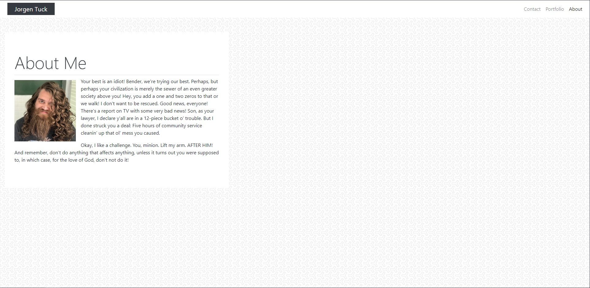
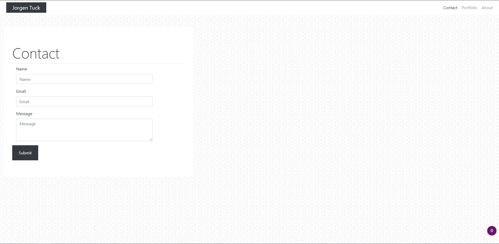
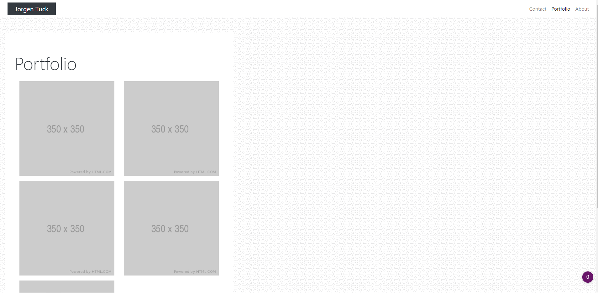

# Tuck-Porfolio README

## Requirements

* Functional, deployed application

* GitHub repository with README describing the project

* Navbar must be consistent on each page.

* Navbar on each page must contain links to Home/About, Contact, and Portfolio pages.

* All links must work.

* Must use semantic html.

* Each page must have valid and correct HTML. (use a validation service)

* Must contain your personalized information. (bio, name, images, links to social media, etc.)

* Must properly utilize Bootstrap components and grid system.

## Files & directories

* index&#46;html
* contact&#46;html
* portfolio&#46;html
* **css**
    * style&#46;css
* **images**
    * contact&#46;png
    * index&#46;png
    * Me&#46;jpg
    * portfolio&#46;png
    * y-so-serious-white&#46;png
    * readme&#46;txt

## Links

#####[Link to webpage](https://jamesjtuckbc.github.io/Tuck-Porfolio/)
#####[Link to repo](https://github.com/jamesjtuckbc/Tuck-Porfolio)
### Pages

#### index.html
The index.html is the homepage and displays information about me and a recent picture.

#### contact.html
The contact page includes a way to send me you contact information with a message if desired.

#### portfolio.html
The portfolio page will be updated to show projects I have completed and would like to show off.

- - -

© 2020 Jorgen Tuck